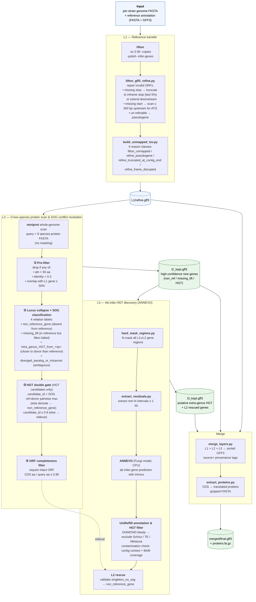

# FissionANNO

A Snakemake pipeline for population-scale genome annotation in haploid fission yeasts (*Schizosaccharomyces*).

## Pipeline Overview



**L1** transfers the reference annotation gene-by-gene to the target strain using [LiftOn](https://github.com/Kuanhao-Chao/LiftOn), followed by a custom refinement step that repairs invalid ORFs (extending to a downstream stop codon, scanning upstream for a missing start codon, or reclassifying as pseudogene when repair is not possible). Genes that could not be transferred are catalogued with one of four reason classes. Main output: `refine.gff3`.

**L2** uses a multi-species protein library to discover genes that L1 missed or that were horizontally transferred within the genus. [miniprot](https://github.com/lh3/miniprot) scans the whole genome without masking; hits overlapping L1 genes are silently dropped. The remaining candidates are classified using a SOG (Schizosaccharomyces orthogroup) table: each locus is assigned one of four relation labels (*non_reference_gene*, *missing_lift*, *intra_genus_HGT_from_\<sp\>*, *diverged_paralog_or_misannot*). HGT candidates pass a double identity gate (absolute floor + SOG-derived pairwise cutoff), and an ORF-completeness filter pushes fragment noise to the sidecar (a separate TSV for manual review). Main output: 1–12 high-confidence new genes per strain.

**L3** targets extra-genus HGT in regions not covered by L1/L2. Gene-annotated regions are hard-masked (replaced with N), and residual intervals ≥ 1 kb are extracted and fed to [ANNEVO](https://github.com/xjtu-omics/ANNEVO), a pretrained deep-learning gene predictor with a Fungi-specific model that supports intron prediction without requiring retraining. Predictions are remapped to original genome coordinates and searched against UniRef50 with DIAMOND. A multi-layer filter removes hits to same-genus proteins, transposable elements, and likely assembly contaminants (verified by contig context and read-depth). As a side effect, L3 also rescues L2 sidecar entries (*singleton_no_sog*) that are independently validated by ANNEVO, reclassifying them as *non_reference_gene*. Main output: 0–3 putative extra-genus HGT candidates per strain.

**Merge** combines L1, L2, and L3 outputs into a single per-strain GFF3 sorted by genomic coordinate, with `source=` provenance tags on every gene and mRNA feature. A companion script translates all CDS features into a gzipped protein FASTA with provenance metadata in the headers, ready for downstream PAV/CNV/identity analyses.

## Setup

Prerequisites: `conda` on PATH.

```bash
git clone <repo> FissionANNO && cd FissionANNO
bash setup_env.sh
export PATH="/data/c/jiaguosong/conda_envs/fissionanno/bin:$PATH"
```

ANNEVO requires a separate environment (CPU-only setup):
```bash
conda create -p /data/c/jiaguosong/conda_envs/annevo python=3.10 -y
export PATH="/data/c/jiaguosong/conda_envs/annevo/bin:$PATH"
pip install torch torchvision torchaudio --index-url https://download.pytorch.org/whl/cpu
pip install bcbio-gff h5py torchmetrics pandas numpy tqdm biopython
git clone https://github.com/xjtu-omics/ANNEVO.git /data/c/jiaguosong/ANNEVO
```

## Run
```bash
cd /data/c/jiaguosong/FissionANNO
export PATH="/data/c/jiaguosong/conda_envs/fissionanno/bin:$PATH"
snakemake --profile profiles/local -n          # dry run
snakemake --profile profiles/local --cores 64  # full run
```
