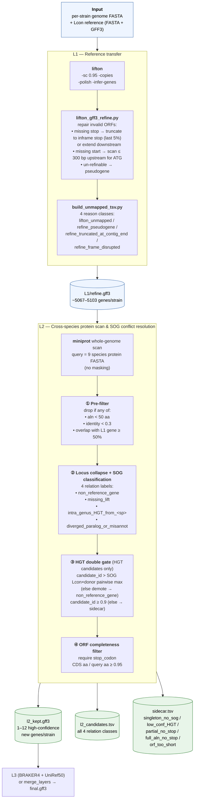

# FissionANNO

Population-scale annotation pipeline for *Schizosaccharomyces pombe* (extensible to other Schizosaccharomyces species).

See [CLAUDE.md](CLAUDE.md) for the design record from the grilling phase.

## Pipeline Overview



**L1** transfers PomBase annotation gene-by-gene to the target strain, with
small-scale start/stop codon repair; unmapped genes are bucketed into 4 reason
classes. Main output: `refine.gff3` (~5k genes/strain).

**L2** uses a 9-species protein library to discover genes that L1 missed or
that were horizontally transferred within the genus. Only hits **not** overlapping
L1 are kept; the SOG table + pairwise identity assign one of 4 relation labels,
and an ORF-completeness filter pushes fragment noise to the sidecar. Main output:
1–12 high-confidence new genes per strain.

## Layout
```
FissionANNO/
  CLAUDE.md                    # decision record
  config/
    config.yaml                # all tunables
    manifest.tsv               # per-strain input
  workflow/
    Snakefile
    rules/
      common.smk
      l1_lifton.smk
      l2_miniprot.smk
      l3_braker4.smk
      merge.smk
    scripts/                   # python helpers
      lifton_gff3_refine.py    # in-tree copy
      build_sog_index.py
      build_unmapped_tsv.py
      l2_conflict_resolve.py
      softmask_regions.py
      run_braker4.py
      l3_uniref50_filter.py
      merge_layers.py
      capture_versions.py
    envs/
      lifton.yaml
      postprocess.yaml
  profiles/
    local/config.yaml          # 64-core single-machine profile
  resources/                   # cached intermediate (built once)
```

## Status
- 2026-05-22: scaffold + L1 refine fixes + SOG/unmapped scripts implemented
- 2026-05-23: conda env installed at `/data/c/jiaguosong/conda_envs/fissionanno` (899 MB)
- L2/L3/merge: rule wiring done; python scripts are placeholders (exit 2)

## Setup

Prerequisites: `micromamba` (or `mamba`) on PATH; `curl`, `tar`, `sed`.

```bash
git clone <repo> FissionANNO && cd FissionANNO
bash setup_env.sh                                                # default prefix
# or:
ENV_PREFIX=/path/to/your/envs/fissionanno bash setup_env.sh      # custom prefix
conda activate /data/c/jiaguosong/conda_envs/fissionanno
```

`setup_env.sh` is end-to-end reproducible: it neutralizes a stale
`~/.condarc`, builds the patched `cigar` wheel (lifton transitive dep
with broken upstream packaging), and installs lifton + pytest in the
right order. Tested from a clean state on 2026-05-23.

The repo is a single conda env. BRAKER4 is invoked as an *external*
Snakemake workflow at `/data/c/jiaguosong/BRAKER4/` via subprocess — it
is **not** installed into this env.

## Next
1. Run refine A1–A5 bug A/B test on 5 sample strains using existing `1.1_lifton_original_gff3` outputs.
2. Implement `build_sog_index.py`, `build_unmapped_tsv.py`, then `l2_conflict_resolve.py`.
3. Smoke-test L1 + L2 on the 5-strain manifest.
4. Wire `run_braker4.py` against the `/data/c/jiaguosong/BRAKER4` workflow.
5. Implement `l3_uniref50_filter.py` and `merge_layers.py`.

## Run
```bash
cd /data/c/jiaguosong/FissionANNO
snakemake --snakefile workflow/Snakefile --profile profiles/local -n   # dry run
```
