# FissionANNO

Population-scale annotation pipeline for *Schizosaccharomyces pombe* (extensible to other Schizosaccharomyces species).

See [CLAUDE.md](CLAUDE.md) for the design record from the grilling phase.

## Pipeline Overview

```mermaid
flowchart TD
    IN["<b>Input</b><br/>per-strain genome FASTA<br/>+ Lcon reference (FASTA + GFF3)"]

    subgraph L1["L1 — Reference transfer"]
        direction TB
        L1A["<b>lifton</b><br/>-sc 0.95  -copies<br/>-polish  -infer-genes"]
        L1B["<b>lifton_gff3_refine.py</b><br/>repair invalid ORFs:<br/>• missing stop → truncate to inframe stop (last 5%)<br/>&nbsp;&nbsp;&nbsp;or extend downstream<br/>• missing start → scan ≤ 300 bp upstream for ATG<br/>• un-refinable → pseudogene"]
        L1C["<b>build_unmapped_tsv.py</b><br/>4 reason classes:<br/>lifton_unmapped / refine_pseudogene /<br/>refine_truncated_at_contig_end /<br/>refine_frame_disrupted"]
        L1A --> L1B --> L1C
    end

    L1OUT[("L1/refine.gff3<br/>~5067–5103 genes/strain")]

    subgraph L2["L2 — Cross-species protein scan & SOG conflict resolution"]
        direction TB
        L2A["<b>miniprot</b> whole-genome scan<br/>query = 9 species protein FASTA<br/>(no masking)"]
        L2B["<b>① Pre-filter</b><br/>drop if any of:<br/>• aln &lt; 50 aa<br/>• identity &lt; 0.3<br/>• overlap with L1 gene ≥ 50%"]
        L2C["<b>② Locus collapse + SOG classification</b><br/>4 relation labels:<br/>• non_reference_gene<br/>• missing_lift<br/>• intra_genus_HGT_from_&lt;sp&gt;<br/>• diverged_paralog_or_misannot"]
        L2D["<b>③ HGT double gate</b> (HGT candidates only)<br/>candidate_id &gt; SOG Lcon×donor pairwise max<br/>(else demote → non_reference_gene)<br/>candidate_id ≥ 0.9 (else → sidecar)"]
        L2E["<b>④ ORF completeness filter</b><br/>require stop_codon<br/>CDS aa / query aa ≥ 0.95"]
        L2A --> L2B --> L2C --> L2D --> L2E
    end

    L2GFF[("l2_kept.gff3<br/>1–12 high-confidence<br/>new genes/strain")]

    subgraph L3["L3 — Ab initio HGT discovery (ANNEVO)"]
        direction TB
        L3A["<b>hard_mask_regions.py</b><br/>N-mask all L1∪L2 gene regions"]
        L3B["<b>extract_residuals.py</b><br/>extract non-N intervals ≥ 1 kb"]
        L3C["<b>ANNEVO</b> (Fungi model, CPU)<br/>ab initio gene prediction with introns"]
        L3D["<b>remap + DIAMOND UniRef50</b><br/>coordinate remap → blastp"]
        L3E["<b>Multi-layer filter</b><br/>• ≥ 200 aa protein + ≥ 200 aa alignment<br/>• exclude Schizo / TE / Metazoa hits<br/>• contamination: contig check + BAM coverage"]
        L3F["<b>L2 rescue</b><br/>validate singleton_no_sog → non_reference_gene"]
        L3A --> L3B --> L3C --> L3D --> L3E --> L3F
    end

    L3GFF[("l3_kept.gff3<br/>0–3 putative HGT/strain")]
    MERGE["merge_layers.py → final.gff3"]

    IN --> L1
    L1 --> L1OUT
    L1OUT --> L2
    L2 --> L2GFF
    L2GFF --> L3
    L3 --> L3GFF
    L2GFF --> MERGE
    L3GFF --> MERGE

    classDef io fill:#eef5ff,stroke:#3366aa,stroke-width:1px,color:#000
    classDef out fill:#e8f5e9,stroke:#2e7d32,stroke-width:1px,color:#000
    class IN,L1OUT io
    class L2GFF,L3GFF out
```



**L1** transfers PomBase annotation gene-by-gene to the target strain, with
small-scale start/stop codon repair; unmapped genes are bucketed into 4 reason
classes. Main output: `refine.gff3` (~5k genes/strain).

**L2** uses a 9-species protein library to discover genes that L1 missed or
that were horizontally transferred within the genus. Only hits **not** overlapping
L1 are kept; the SOG table + pairwise identity assign one of 4 relation labels,
and an ORF-completeness filter pushes fragment noise to the sidecar. Main output:
1–12 high-confidence new genes per strain.

**L3** runs ANNEVO (pretrained Fungi DNN) on residual regions not covered by
L1/L2, targeting extra-genus HGT. Hard-masks annotated regions, extracts ≥1 kb
fragments, predicts genes ab initio (with introns), then filters by UniRef50
(drop no-hit, exclude Schizo/TE/contamination). Also rescues L2 sidecar entries
validated by ANNEVO. Main output: 0–3 putative HGT candidates per strain.

## Layout
```
FissionANNO/
  CLAUDE.md                    # decision record
  config/
    config.yaml                # all tunables
    manifest.tsv               # per-strain input
  workflow/
    Snakefile
    rules/
      common.smk
      l1_lifton.smk
      l2_miniprot.smk
      l3_annevo.smk
      merge.smk
    scripts/
      lifton_gff3_refine.py
      build_sog_index.py
      build_unmapped_tsv.py
      l2_conflict_resolve.py
      hard_mask_regions.py
      extract_residuals.py
      remap_coordinates.py
      l3_diamond_search.py
      l2_rescue_from_l3.py
      l3_uniref50_filter.py
      merge_layers.py
      capture_versions.py
  profiles/
    local/config.yaml          # 64-core single-machine profile
```

## Status
- L1: verified end-to-end on 5 test strains (2026-05-23)
- L2: conflict resolution v6, verified on 5 strains (2026-05-24)
- L3: ANNEVO-based HGT discovery, verified on 5 strains (2026-05-26)
- Merge: implemented, pending full integration test

## Setup

Prerequisites: `conda` on PATH.

```bash
git clone <repo> FissionANNO && cd FissionANNO
bash setup_env.sh
export PATH="/data/c/jiaguosong/conda_envs/fissionanno/bin:$PATH"
```

ANNEVO requires a separate environment (CPU-only setup):
```bash
conda create -p /data/c/jiaguosong/conda_envs/annevo python=3.10 -y
export PATH="/data/c/jiaguosong/conda_envs/annevo/bin:$PATH"
pip install torch torchvision torchaudio --index-url https://download.pytorch.org/whl/cpu
pip install bcbio-gff h5py torchmetrics pandas numpy tqdm biopython
git clone https://github.com/xjtu-omics/ANNEVO.git /data/c/jiaguosong/ANNEVO
```

## Run
```bash
cd /data/c/jiaguosong/FissionANNO
export PATH="/data/c/jiaguosong/conda_envs/fissionanno/bin:$PATH"
snakemake --profile profiles/local -n          # dry run
snakemake --profile profiles/local --cores 64  # full run
```
