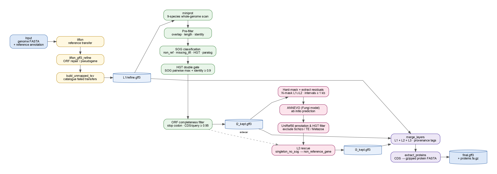

# FissionANNO

A Snakemake pipeline for population-scale genome annotation in haploid fission yeasts (*Schizosaccharomyces*).



## Workflow

**L1** stage transfers the reference annotation gene-by-gene to the target strain using [LiftOn](https://github.com/Kuanhao-Chao/LiftOn), followed by a custom refinement step that repairs invalid ORFs through three sequential strategies: (1) if an internal stop codon is found within the last 5% of the CDS length, truncating to that stop codon; (2) if no internal stop codon is present, extending downstream to find a stop codon; (3) if a valid stop codon is in place but the start codon is absent, the upstream sequence is scanned within a 300 bp window to recover a missing start codon; and (4) if none of the above repairs succeed, the locus is reclassified as a **pseudogene**. Genes that fail to transfer are catalogued under one of four predefined reason classes: `lifton_unmapped`, `refine_pseudogene`, `refine_truncated_at_contig_end`, and `refine_frame_disrupted`. Main output: `refine.gff3`.

**L2** stage leverages a multi-*Schizosaccharomyces* species protein library to recover genes missed by L1 and to detect intra-genus horizontal gene transfer (HGT) events. [miniprot](https://github.com/lh3/miniprot) aligns the protein library against the unmasked whole genome; any hits overlapping L1-annotated loci are silently dropped. The remaining candidates are classified against a SOG (*Schizosaccharomyces* orthogroup) table, with each locus assigned one of four relationship labels:
- `non_reference_gene` — present in the target but absent from the reference (no reference species member in the SOG, or candidate identity not exceeding the SOG pairwise cutoff)
- `missing_lift` — a reference gene that L1 failed to transfer (SOG has a reference species member; target has a hit closer to the reference than to any other species)
- `intra_genus_HGT_from_<sp>` — likely acquired by horizontal transfer from a congeneric species (target hit is ≥ 10 pp more similar to donor species than to the reference, passes the absolute identity threshold, and exceeds the SOG-derived pairwise cutoff)
- `diverged_paralog_or_misannot` — a diverged paralog or potential mis-annotation (all hits below the diverged identity floor, or no hits from non-reference species)

HGT candidates must pass a two-tier identity gate: (1) an absolute threshold requiring > 90% protein sequence identity to the donor protein; and (2) a SOG-derived pairwise cutoff requiring that the candidate identity exceeds the precomputed maximum pairwise identity between any reference species SOG member and any member from the donor species — if no such pairwise data exists for the SOG, the candidate is demoted to `non_reference_gene`. Finally, candidates that survive both filters are subject to an ORF-completeness filter; fragmented loci are relegated to a sidecar TSV for manual review. Main output: `l2_kept.gff3`.

**L3** targets extra-genus HGT in regions not covered by L1/L2. Gene-annotated regions are hard-masked (replaced with N), and residual intervals ≥ 1 kb are extracted and fed to [ANNEVO](https://github.com/xjtu-omics/ANNEVO), a pretrained deep-learning gene predictor with a Fungi-specific model that supports intron prediction without requiring retraining. Predictions are searched against UniRef50 with DIAMOND; a multi-layer filter removes hits to same-genus proteins, transposable elements, and likely assembly contaminants. L3 also rescues L2 sidecar entries (*singleton_no_sog*) independently validated by ANNEVO, reclassifying them as *non_reference_gene*. Main output: `l3_kept.gff3`.

**Merge** combines L1, L2, and L3 outputs into a single per-strain GFF3 sorted by genomic coordinate, with `source=` provenance tags on every gene and mRNA feature. A companion script translates all CDS features into a gzipped protein FASTA with provenance metadata in the headers, ready for downstream PAV/CNV/identity analyses.

### Pipeline diagram

```mermaid
flowchart TD
    IN["<b>Input</b><br/>per-strain genome FASTA<br/>+ reference annotation (FASTA + GFF3)"]

    subgraph L1["L1 — Reference transfer"]
        direction TB
        L1A["<b>lifton</b><br/>-sc 0.95 -copies -polish"]
        L1B["<b>lifton_gff3_refine.py</b><br/>missing stop → truncate / extend downstream<br/>missing start → scan ≤ 300 bp upstream<br/>un-refinable → pseudogene"]
        L1C["<b>build_unmapped_tsv.py</b><br/>lifton_unmapped · refine_pseudogene<br/>refine_truncated_at_contig_end · refine_frame_disrupted"]
        L1A --> L1B --> L1C
    end

    L1OUT[("L1/refine.gff3")]

    subgraph L2["L2 — Cross-species protein scan & SOG conflict resolution"]
        direction TB
        L2A["<b>miniprot</b><br/>whole-genome scan · 9-species protein library"]
        L2B["<b>① Pre-filter</b><br/>aln ≥ 50 aa · identity ≥ 0.3<br/>drop if overlap L1 ≥ 50%"]
        L2C["<b>② SOG classification</b><br/>non_reference_gene · missing_lift<br/>intra_genus_HGT_from_&lt;sp&gt; · diverged_paralog"]
        L2D["<b>③ HGT double gate</b><br/>identity &gt; SOG pairwise max AND ≥ 0.9<br/>(else demote or → sidecar)"]
        L2E["<b>④ ORF completeness filter</b><br/>intact stop codon · CDS/query aa ≥ 0.95"]
        L2A --> L2B --> L2C --> L2D --> L2E
    end

    L2GFF[("l2_kept.gff3<br/>high-confidence new genes<br/>non_ref · missing_lift · HGT")]

    subgraph L3["L3 — Ab initio HGT discovery (ANNEVO)"]
        direction TB
        L3A["<b>hard_mask + extract_residuals</b><br/>N-mask L1∪L2 · extract intervals ≥ 1 kb"]
        L3C["<b>ANNEVO</b> (Fungi model, CPU)<br/>ab initio prediction with introns"]
        L3D["<b>UniRef50 annotation &amp; HGT filter</b><br/>DIAMOND blastp · exclude Schizo / TE / Metazoa<br/>contig context + BAM coverage check"]
        L3E["<b>L2 rescue</b><br/>singleton_no_sog + ANNEVO overlap<br/>→ non_reference_gene"]
        L3A --> L3C --> L3D --> L3E
    end

    L3GFF[("l3_kept.gff3<br/>putative extra-genus HGT<br/>+ L2 rescued genes")]

    subgraph MG["Merge"]
        direction TB
        MGA["<b>merge_layers.py</b><br/>L1 + L2 + L3 · sorted by coordinate<br/>source= provenance tags"]
        MGB["<b>extract_proteins.py</b><br/>CDS → translated proteins · gzipped FASTA"]
        MGA --> MGB
    end

    FINAL[("merged/final.gff3<br/>+ proteins.fa.gz")]

    IN --> L1
    L1 --> L1OUT
    L1OUT --> L2
    L2E --> L2GFF
    L2GFF --> L3
    L2E -.->|sidecar| L3E
    L3E --> L3GFF
    L1OUT --> MG
    L2GFF --> MG
    L3GFF --> MG
    MG --> FINAL

    classDef io fill:#eef5ff,stroke:#3366aa,stroke-width:1px,color:#000
    classDef out fill:#e8f5e9,stroke:#2e7d32,stroke-width:1px,color:#000
    class IN,L1OUT io
    class L2GFF,L3GFF,FINAL out
```



## Setup

Prerequisites: `conda` on PATH.

```bash
git clone <repo> FissionANNO && cd FissionANNO
bash setup_env.sh
export PATH="/data/c/jiaguosong/conda_envs/fissionanno/bin:$PATH"
```

ANNEVO requires a separate environment (CPU-only setup):
```bash
conda create -p /data/c/jiaguosong/conda_envs/annevo python=3.10 -y
export PATH="/data/c/jiaguosong/conda_envs/annevo/bin:$PATH"
pip install torch torchvision torchaudio --index-url https://download.pytorch.org/whl/cpu
pip install bcbio-gff h5py torchmetrics pandas numpy tqdm biopython
git clone https://github.com/xjtu-omics/ANNEVO.git /data/c/jiaguosong/ANNEVO
```

## Run
```bash
cd /data/c/jiaguosong/FissionANNO
export PATH="/data/c/jiaguosong/conda_envs/fissionanno/bin:$PATH"
snakemake --profile profiles/local -n          # dry run
snakemake --profile profiles/local --cores 64  # full run
```
